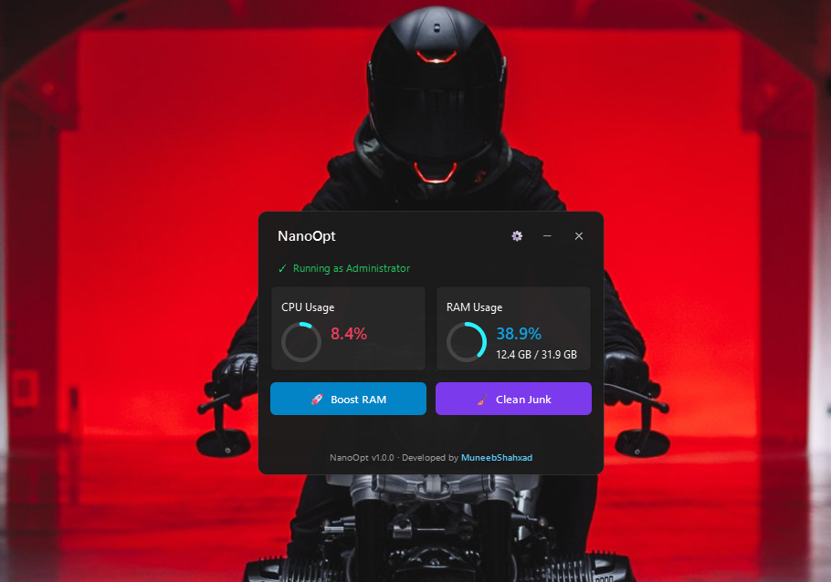

  

# 🚀 NanoOpt — High Performance Windows PC Optimizer

  
  
  
  

  <strong>Lightweight · Modern Fluent Design · Safe RAM Purge · Junk Cleaner · Auto-Optimizer</strong>

---

> **Notice:** NanoOpt is a **closed-source, proprietary application**. The source code is private and protected. Only official, pre-compiled standalone executables (`NanoOpt.exe`) are distributed for end-users.

---

## ✨ Features

- **🚀 Smart RAM Boost**: Safely frees memory via Windows `EmptyWorkingSet` while protecting critical apps.
- **🧹 System Junk Cleaner**: Cleans User Temp, Windows Temp, Prefetch, LogFiles, SoftwareDistribution downloads, crash dumps, and empties the Recycle Bin.
- **⚙️ Configurable JSON Settings**: Customize auto-purge RAM thresholds, polling intervals, and notification preferences.
- **🛡️ Process & Directory Whitelist**: Built-in exclusions for streaming apps (OBS), system components (`dwm.exe`, `explorer.exe`), games, and custom paths.
- **🔔 Windows System Tray & Toast Notifications**: Runs discreetly in your taskbar with rocket icon and delivers native Windows notifications when memory is recovered.
- **🪟 Auto-Start on Boot**: Configures Windows Task Scheduler with `HighestPrivileges` to seamlessly start with Windows without UAC prompts.
- **📊 Exportable Activity Logs**: Track every byte saved with rotating log files and one-click CSV exports.
- **🔄 Auto-Updates (OTA)**: Automatically checks GitHub Releases for new updates and performs seamless one-click file updates.
- **🎨 Windows 11 Fluent UI**: System-adaptive dark and light mode powered by PySide6 and Fluent Widgets.

---

## 📥 Download & Usage

1. Head to the official [**Releases**](https://github.com/muneebshahxad/NanoOpt/releases) page.
2. Download the latest compiled binary (`NanoOpt.exe`).
3. Right-click and select **Run as Administrator** (required for deep system cache cleanup and memory management).
4. No installation or Python setup needed — it is a standalone portable application.

---

## 📜 License

Copyright (c) 2026 MuneebShahxad. All Rights Reserved.  
This software is proprietary. Unauthorized copying, modification, or distribution is strictly prohibited.  
See the [LICENSE](LICENSE) file for legal terms.

---

## 👤 Author
Developed by **[MuneebShahxad](https://github.com/muneebshahxad)**
